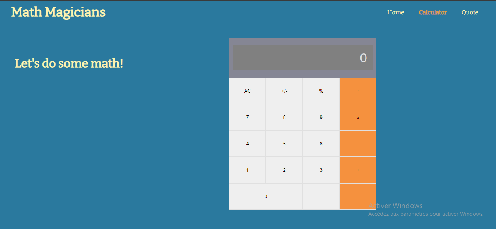

## Maths Magician

> This is a Single page app that allows users to make simple calculations.

## Built With

- React

## Getting Started 
To have this project on your local machine, just follow these steps

- Clone the repository using `https://github.com/emmanuellekamwa/Maths-magician.git`
- Browse into the project's directory by typing `cd maths-magician`
- To install all the dependencies, run `npm install`
- To run the app on the browser, run `npm start`

## Authors

👤 **Emmanuelle Kamwa**

-   Github: [@emmanuellekamwa](https://github.com/emmanuellekamwa)
-   Twitter: [@AlixKamwa](https://twitter.com/AlixKamwa)
-   Linkedin: [emmanuelle-kamwa-86145a1a4](https://www.linkedin.com/in/emmanuelle-kamwa-86145a1a4/)

## 🤝 Contributing

Contributions, issues, and feature requests are welcome!

## Show your support

Give a ⭐️ if you like this project!

## Acknowledgments

- Hat tip to anyone whose code was used
- Inspiration

## 📝 License

This project is [Microverse](https://www.microverse.org/) licensed.

